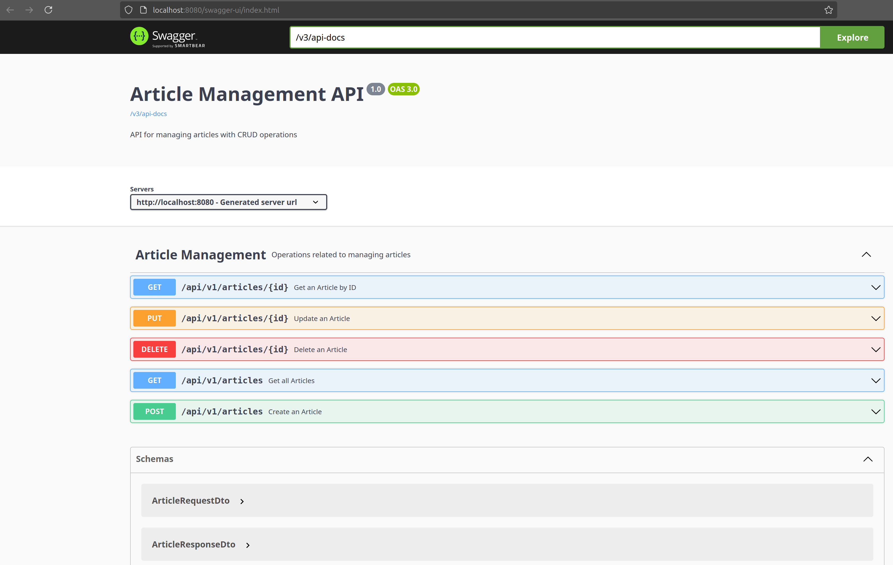

# **Spring Boot Article Management API**

This is a simple Spring Boot application demonstrating a CRUD API for managing articles. The project uses an in-memory list to simulate a database and is structured to follow best practices for a Spring Boot application.

---

## **Features**
- Create, retrieve, update, and delete articles.
- Integrated input validation with detailed error handling.
- Notification service for article events (mock implementation).
- API documentation provided via Swagger UI.

---

## **Prerequisites**
Ensure you have the following installed:
- Java 21+
- SpringBoot 3
- Maven 3.8+
- Git

---

## **Getting Started**

### **Clone the Repository**
1. Open a terminal and clone the repository:
   ```bash
   git clone https://github.com/PalmaPedro/article-api
   cd artice-api

### **Build the project**
1. Open a terminal (runs on PORT 8080 by default):
   ```bash
   mvn clean install
   mvn spring-boot:run

### **Using Maven profiles**
1. You may run the application with tests (default):
   ```bash
   mvn clean install -Pwith-tests

2. Or without tests:
   ```bash
   mvn clean install -Pwithout-tests

### **Test the API with Swagger UI**
1. Having the project running, go to:
   ```bash
   http://localhost:8080/swagger-ui/index.html

You should be able to see this:




   
